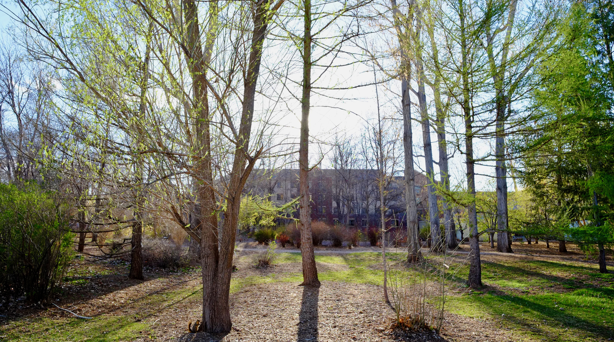

{#cottonwood-cathedral .margin-caption}

Whether to create shelter or beauty, tree planting is one of the most common ways people improve their surroundings throughout much of the western U.S. In fact, our annual Arbor Day traditions emerged from a heightened appreciation for trees on the Great Plains. In 1872, J. Sterling Morton proposed the new holiday celebrating trees after moving to the Nebraska prairie and missing the natural forest cover of his earlier home. At the arboretum, we celebrate and support a strong tradition of tree stewardship in the west, and we foster the longstanding relationship between people and trees to create a better future for everyone. 

## Vision

We envision a future with people and trees thriving in healthy, sustainable communities throughout the Great Plains and Rocky Mountains.

## Mission

We inspire and equip people to appreciate and steward trees adapted to the harsh conditions of landscapes throughout Colorado and surrounding areas. We fulfill our purpose through education, research, and sustainable practices in a landscape dedicated to people and trees. 
