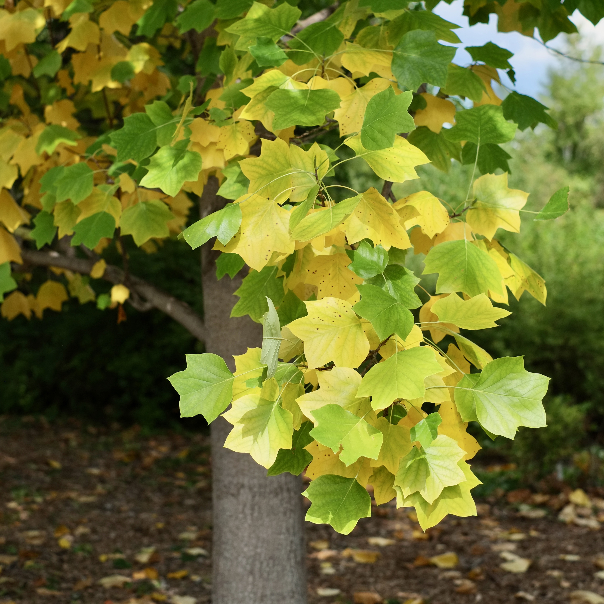
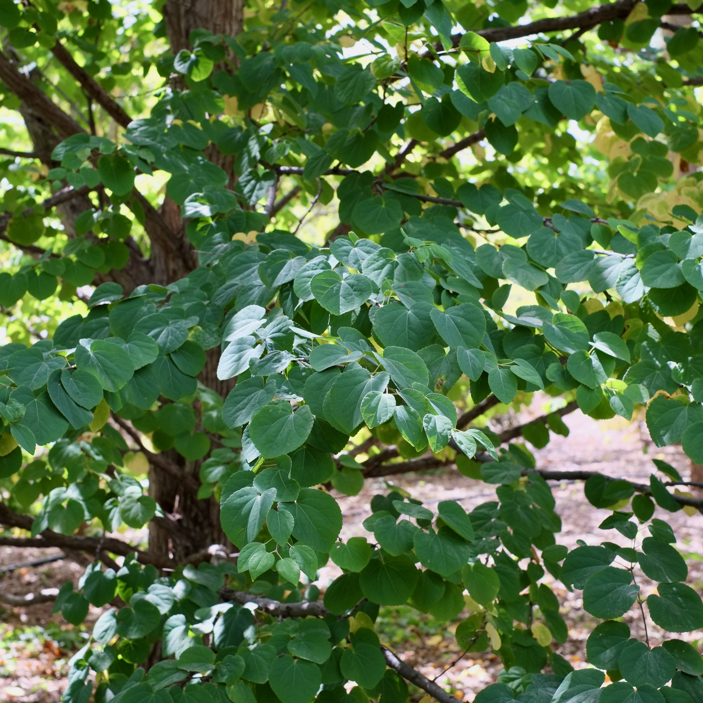
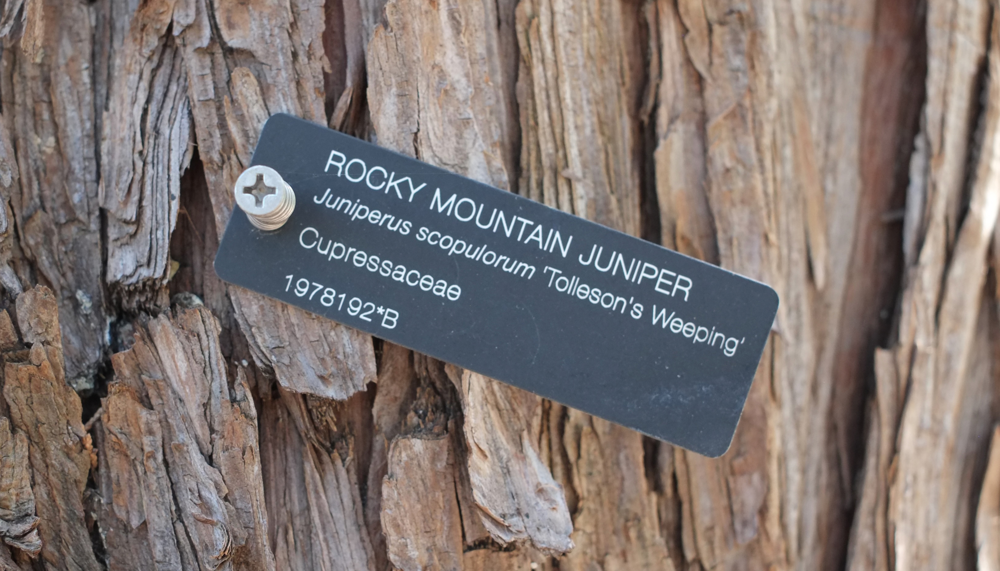

::: {layout-ncol=3}
{.lightbox group="gallery"}

{.lightbox group="gallery"}

{.lightbox group="gallery"}
:::

## Tree Explorer Map

Using our interactive map, you can easily explore the arboretum's tree collection through our updated records. With the search bar, you can look up plants by their names or accession numbers, and you can find more detailed information about each plant by clicking on the green markers. On the bottom of the page, you can quickly compare details about multiple trees in the expandable table. 

::: {.column-page-inset}
```{=html}
<style>.embed-container {position: relative; padding-bottom: 80%; height: 0; max-width: 100%;} .embed-container iframe, .embed-container object, .embed-container iframe{position: absolute; top: 0; left: 0; width: 100%; height: 100%;} small{position: absolute; z-index: 40; bottom: 0; margin-bottom: -15px;}</style><div class="embed-container"><iframe height="900" frameborder="0" scrolling="yes" marginheight="0" marginwidth="0"  src="//arcg.is/1yzvz00"></iframe></div>
```
:::


## Labels
You may notice that many of our plants are labeled in the arboretum. The labels contain essential information about each plant, and they're formatted consistently with the same information arranged from top to bottom. 

{.lightbox width=50%}

#### Common name
The common name is the most widely recognized name of a species. Although familiar to many, common names are not always reliable because people living in different regions may use different names for the same species. 

#### Scientific name
The scientific name is the official species name recognized anywhere in the world, and it consists of two parts representing different levels of classification: the genus and specific epithet.  The entire scientific name is always italicized with the first letter of the genus capitalized. The scientific name may also contain a more detailed botanical classification, such as a subspecies (ssp.) or form (f.), or a cultivar name (shortened from cultivated variety) in single quotes at the end. The cultivar name is often given to plant varieties with noteworthy characteristics, such as color, size, or habit. 

#### Botanical family
The botanical family is a broader classification containing many related members all descending from a common ancestor. For example, maples (*Acer* spp.) and buckeyes (*Aesculus* spp.) are both members of the Soapberry Family, Sapindaceae.

#### Accession number
The accession number assigned to each tree is a unique identifier used for tracking and monitoring. The first four digits show the year the tree was received, and the subsequent numbers show the order in which the tree was received the same year. If present, letters denote multiples of the same type of plant. For example, the accession label above indicates the tree was the 192nd plant acquired in 1978, and it was part of a larger group of the same variety. 

